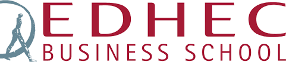

  
# Artificial Intelligence Workshop Evaluations

This page describes the assessment work expected. **READ it carefully** to understand the expectations.

## Mission
Your mission in this project is to identify a business model which would benefit from **Artificial Intelligence** in any ways, be it through transformed customer experience, improved service quality or any disruptive transformation.
Your work, as a team, is to define the added value of your proposal and make evidence of how usage of **Artificial Intelligence** is impactful.
From a technical side, your mission is to implement technics and technologies learned throughout the workshop to build your solution and integrate it making clear evidence of the concepts learned in class: **Computer Vision** and/or **Natural Language Processing**.
 As such, please do the following:
1.	Form a team (groups of 5 people, no individual work is accepted)
2.	Write an executive summary of your solution
3.	Use the technologies you know and those learned in class to build image classification, image tagging, text classification, sentiment analysis or any topic relevant to **AI**
4. Show evidences of these models through series of tests and retraining phases.
5.	Draft a high level architecture of how components of your solution might integrate. (Please refer to Code Patterns)
6.	Draft a mockup of your solution which should emphasize user interaction and AI services invocation (think about workflow)
7. Build as much as you can in terms of front-end, integration and orchestration of AI services.

## Evaluation
Your group will be evaluated based on your capabilities of:
+ Stating the business challenge(s) your solution is meant to address (What?)
+ Explore the actual problems and pain points of the domain your solution is focusing on. (Why?)
+ Make evidence of AI as a way to solve the problems and pain points.
+ Applying the methods used in class (NLP, Computer Vision).
+	Combining these in a "solution" focused on end user. (Integrate)

**Output format:** Please prepare a report in a doc, pdf format which is the executive summary of your project.
>The report must be structured in the following way:
>+	Title, authors, group
>+	Executive Summary
>+	Introduction
>+	Problem Statement
>+	Methodology (should include a high level architecture of your solution)
>+	Findings
>+	Discussion  

**Tools:** you’re free to use the tools we have presented (Watson Studio, Watson Assistant, Watson Visual Recognition, Watson NLC, Watson NLU) and other tools you might be familiar with.
**Hints:** you’re free to leverage tutorials and videos of usage of the tools. Innovate.
**Considerations:** you will be evaluated on your **analytical approach** to solve the business problem.

### Deliverables
Deliverables include:
+ The Executive Summary report
+ A Powerpoint presentation used to present on the final Day
+ Code and artifacts developped throughout the project (Github repo)

**REMEMBER: LEVERAGE TUTORIALS AND CODE PATTERNS POSTED ON THE GIT REPO. ANYTIME YOU STRUGGLE, CONTACT ME `genard@fr.ibm.com`, I'LL GUIDE YOU TOWARDS TUTORIAL AND CODE SAMPLES THAT WILL HELP YOU IN INTEGRATING EVERYTHING**

Your grade will mostly rely on:
+	The approach and your group reasoning and expressing the business challenges
+ The innovation
+	The capability of answering complex questions in simple ways
+	The quality and effectiveness of analytical research
+	The quality and effectiveness of your communication

## Due Date: April 19th, 2019

>Note: **Prefix** your mails to me with the following subject: `EDHEC - AI - GroupWork`
---
